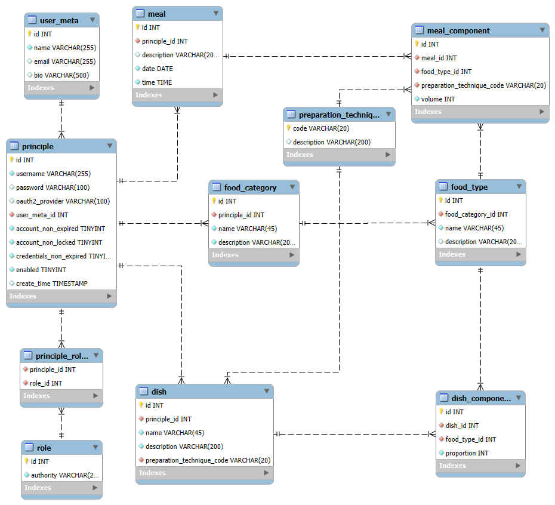

# GutHealth

Currently under transformation from my CodingNomads Java 301 module Capstone project to my Java Advanced Capstone project.

## Table of contents:

- [Introduction](#introduction)
  - [Overview](#overview)
  - [Data Categories](#data-categories)
  - [User Interaction](#user-interaction)
- [Technologies](#technologies)
- [Change Log](#change-log)
  - [Implemented](#implemented)
  - [Current Phase](#current-phase)
  - [Future Phases](#future-phases)
- [Data Model](#data-model)

# Introduction

### Overview
GutHealth is the seeds of an applications which will track consumption and gut health and finally use AI to detect links between the two.

The current phase allows the user to capture food types and dishes to enable the capture of consumption (Meals).
Future phases will allow the capture of gut health and other related data, and finally AI to identify relationships between consumption and gut health.

### Data categories
- Lookup values (All are user configurable)
  - Preparation Technique - This describes how the food was prepared such as Boiled, Pan Fried, Roasted etc. We expect minimal changes to this dataset once it is created.
  - Food Category - This is used to break the food into various categories such as Dairy, Protein, Grains, Fruits and Vegetables etc. but it is user configurable. Again, we expect minimal modifications once the dataset is created.
  - Food Type - These are various food types such as Carrots, Broccoli, Beef Steak, Beef Mince, Potatoes, Salt etc. This can be as general as you like. For example, it may be simpler to have a food type of 'Beef' rather than different types of beef in order to keep the number of elements to a minimum. This dataset is expected to grow as time passes, and is used as a lookup when creating the components of dishes and meals. We do filter by category to reduce the volume of records displayed when selecting.
- Primary data values (Consumption Data)
  - Dish - The parent record of a particular dish such as Chilli con Carne or a particular Signature Salad. The name is unique and will specify the preparation technique, such as Braised for the former and Raw for the latter. Given the preparation technique is applicable to all the components of a particular dish, it might also be considered a 'Pot' of food.
  - Dish Component - This is a component belonging to a particular dish. Of particular interest here is the **proportion** field. Please see more about this below.
  - Meal (pending implementation) - The meal parent record for the food (and drink) consumed in a particular sitting. This is currently identified by a date and time.
  - Meal component (pending implementation) - These describe the individual food items consumed during a meal. Meal components can be added individually, or from copied from one or more dishes. The preparation technique is relevant to the food item and not the meal as the meal could consist of multiple dishes, each prepared in a different manner. The **volume** here indicates the volume of the particular food item consumed during the meal.

The only matter that may need further explanation is how the volume of a particular meal component is determined when adding components based on a dish. The volume of the meal is specified by the user, and then the volume of the component is calculated as dishVolume*dishComponentProportion/SumOf(dishComponentProportion). Note: This may not sum up exactly to the volume specified due to rounding during the calculation mentioned.

### User Interaction

There are 3 categories of user:-
- ADMIN - Carry out user and role administration. (not yet implemented)
- GUEST - This user can view the lookup data as owned by the 'system' user
- USER  - This user can create their own lookup data as well as import 'system' lookup data into their own dataset. User data is private to the user and can only be viewed by and edited by the given user.

Users can create an account using GitHub or Google OAuth2 or by entering a username and password. The user will be assigned the GUEST role at this point.

A user must register in order to be able to create their own data from their profile page. Registering currently assigns the USER role to the given user.

__Note__ that all 3 user types can create and maintain tasks as implemented using the CodingNomads Task API *provided* the user has saved an email address.

__Note__ further, that all tasks are wiped from the CodingNomads database at Noon PST, so cannot currently be counted on to persist from one day to the next.

# Technologies
GutHealth is a Java 21 Spring Boot application using:
- Spring MVC
- Spring Security
- Spring JPA
- Spring AOP
- Lombok
- Thymeleaf
- HTML
- JavaScript
- Actuator
- Swagger
- Hazelcast caching
- H2 in memory database (for testing and as an available profile for quick development without a database)
- Flyway
- MySQL is used as the persistent repository
- CodingNomads TaskList API at http://demo.codingnomads.co:8080/tasks_api/swagger-ui/index.html

# Change Log

## Implemented
- Implement TRACE level (configurable using actuator) logging of all methods using AOP to assist troubleshooting. 
- Spring Data JPA
- Implementing basic CRUD REST APIs for the various entities (DTOs exposed as Java Record)
- Spring Web MVC / Thymeleaf Templates (Basic CRUD) (currently excludes Meal data)
- Spring Security - Implementation of a User entity, and associated OAuth2 / UID & password authentication including custom login form and profile edit form
- Updating views to standard view and modifying data capture to include dropdown select where relevant
- FoodType and FoodCategory caching using Hazelcast cache
- Improved feedback on views rather than a single error page
- Refine views to use dropdowns, ajax etc. Basically make it prettier and more usable.
- Integration tests of REST controllers
- Unit test coverage of View Controllers (Not exhaustive)
- Default new user as GUEST and require proactive user registration for USER role 
- Refactor PreparationTechnique into a USER related data item
- Implementation of GUEST role and allow GUEST to view SYSTEM data (PreparationTechnique, FoodCategory & FoodType)
- Allow USER role to import SYSTEM PreparationTechnique, FoodCategory and FoodType data into the USER personal dataset
- Modify preparationTechnique dropdown in Dish views to work with new data structure
- Add logging of SYSTEM data copy and new user registration using AOP
- 3rd Party API integration to fetch GitHub OAuth2 authenticated user's email address
- 3rd Party API integration - Implement task list for users
- Implement FlyWay to initialise database
- AWS deployment prior to submitting to CodingNomads for certificate application
- 
## Current phase:
- Admin user maintenance
- [x] reset user passwords
- [x] update user and user meta
- [] select user to maintain
- [] Maintain user roles
- [] Menu option to show user maintenance form if has role ADMIN

## Future Phases
- remove disabling of CSRF and test
*In no particular order*
- Implement dedicated log file with rolling appender etc
- Programmatically refresh security context when new role assigned to user
- Search for particular FoodType
- Allow USER to register for notification when new SYSTEM data is setup
- Send new user a welcome email
- Send registered users a usage email

- [] Meal MVC
- Filter meals based on date or description
- Addition of Gut Health itself (Data Structure, API, UI etc.)
- - This might be implemented in a separate NoSql database as I'm not clear on the data structure as this may include miood and other factors
- Context sensitive documentation
- Android UI
- AI analysis of consumption and gut health and reporting of patterns (Python and AI study required prior to this phase) 

## Implemented, and now Parked due to ongoing costs
- AWS deployment including:-
  - RDS database
  - Route 53
  - Load Balancer
  - Autoscaling
  - CI/CD using CodePipeline from GitHub
  - Multiple instances

# CURRENT USAGE
Use `/swagger-ui.html/index.html#/` for API description

# Data Model
Please see the attached ER diagram for further detail.

