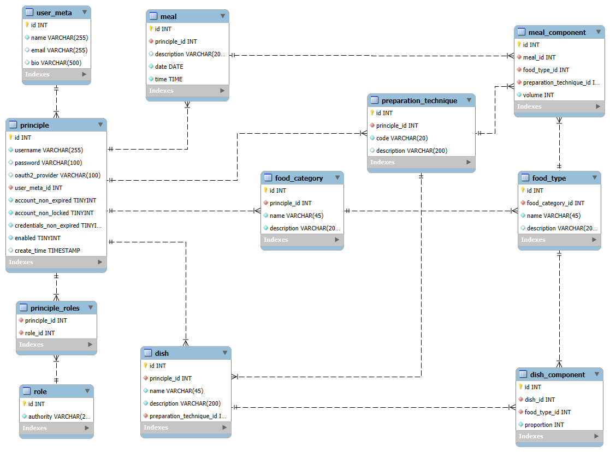

# GutHealth

GutHealth is the seeds of an applications which will track consumption and gut health and finally use AI to detect links between the two.

Currently under transformation from my CodingNomads Java 301 module Capstone project to my Java Advanced Capstone project. 

# Implemented
- Spring Data JPA
- Implementing basic CRUD REST APIs for the various entities (DTOs exposed as Java Record)
- Spring Web MVC / Thymeleaf Templates (Basic CRUD) (currently excludes Meal data)
- Spring Security - Implementation of a User entity, and associated OAuth2 / UID & password authentication including custom login form and profile edit form
- Updating views to standard view and modifying data capture to include dropdown select where relevant
- FoodType and FoodCategory caching using Hazelcast cache
- 
# Currently phase:

# Future Phases showcasing (In no particular order)
- [] Meal MVC
- [x] Refine views to use dropdowns, ajax etc. Basically make it prettier and more usable.
- File Load using API
- [x] Data caching
- Addition of Gut Health itself (Data Structure, API, UI etc.)
- Third party API integration
- Android UI
- AI analysis of consumption and gut health and reporting of patterns (Python and AI study required prior to this phase) 

# Implemented, and now Parked due to ongoing costs
- AWS deployment including:-
  - RDS database
  - Route 53
  - Load Balancer
  - Autoscaling
  - CI/CD using CodePipeline from GitHub
  - Multiple instances

### Data categories:-
- Lookup values
  - Preparation Technique - This describes how the food was prepared such as Boiled, Pan Fried, Roasted etc. We expect minimal changes to this dataset once it is created. 
  - Food Category - This is used to break the food into various categories such as Dairy, Protein, Grains, Fruits and Vegetables etc. but it is user configurable. Again, we expect minimal modifications once the dataset is created.
  - Food Type - These are various food types such as Carrots, Broccoli, Beef Steak, Beef Mince, Potatoes, Salt etc. This can be as general as you like. For example, it may be simpler to have a food type of 'Beef' rather than different types of beef in order to keep the number of elements to a minimum. This dataset is expected to grow as time passes, and is used as a lookup when creating the components of dishes and meals. We do filter by category to reduce the volume of records displayed when selecting.
- Primary data values
  - Dish - The parent record of a particular dish such as Chilli con Carne or a particular Signature Salad. The name is unique and will specify the preparation technique, such as Braised for the former and Raw for the latter. Given the preparation technique is applicable to all the components of a particular dish, it might also be considered a 'Pot' of food.
  - Dish Component - This is a component belonging to a particular dish. Of particular interest here is the **proportion** field. Please see more about this below.
  - Meal - The meal parent record for the food (and drink) consumed in a particular sitting. This is currently identified by a date and time. 
  - Meal component - These describe the individual food items consumed during a meal. Meal components can be added individually, or from copied from one or more dishes. The preparation technique is relevant to the food item and not the meal as the meal could consist of multiple dishes, each prepared in a different manner. The **volume** here indicates the volume of the particular food item consumed during the meal.

The only matter that may need further explanation is how the volume of a particular meal component is determined when adding components based on a dish. The volume of the meal is specified by the user, and then the volume of the component is calculated as dishVolume*dishComponentProportion/SumOf(dishComponentProportion). Note: This may not sum up exactly to the volume specified due to rounding during the calculation mentioned.

### File load:
- Food Types.
  - Fields are pipe delimited and minimal validation is applied.
  - Record format is: `<foodCategoryName>|<foodTypeName>|<foodTypeDescription>`
  - `<fileName>.err` file is created containing records that have failed load along with a textual description of why they failed to load

# CURRENT USAGE
Use `/swagger-ui.html/index.html#/` for API description

## Data Model
Please see the attached ER diagram for further detail.

